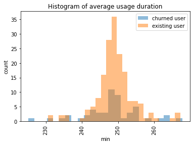
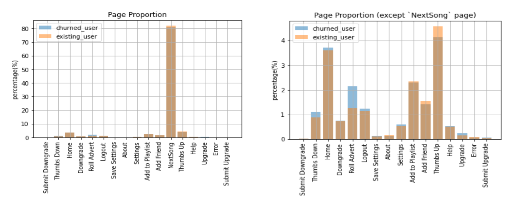
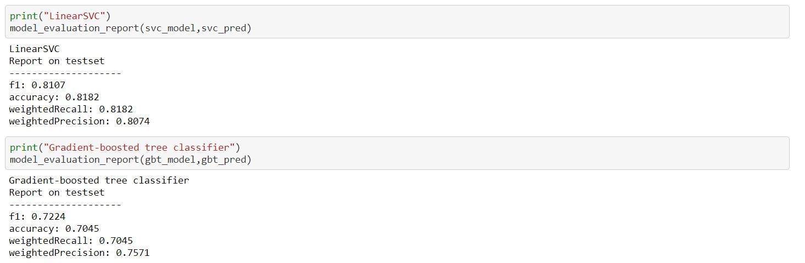

# Sparkify_User-Churn-Alert

*Sparkify* is a fake music streaming platform that proposes to its customers to listen to their favorite songs via a free offer that includes advertisement while using the platform or via the paid offer without advertisements.

The project is proposed by [Udacity](https://www.udacity.com/) and aims at training the application of machine learning as part of the [Data Scientist Nanodegree](https://www.udacity.com/course/data-scientist-nanodegree--nd025) leveraging the power of distributed computation with [Spark](https://spark.apache.org/).

> For more about data analysis, you can find out on [my blog](https://wenjingleaf.medium.com/user-churn-alert-based-on-pyspark-9bf164f97d47) :)


## Package

In python `3.x`, the following packages are used in this project:

- numpy
- pandas
- pyspark
- datetime
- matplotlib


## Data Understanding

The data is part of the user activity log and it includes the following :

```tex
User Information
 |-- firstName: 	   string	
 |-- lastName: 	    string  	 
 |-- gender: 		     string 		
 |-- location:    		string 	
 |-- userAgent: 	   string 		device infomation
 
User Count Information
 |-- userId: 		     string 
 |-- level: 		      string 		paid/free version
 |-- registration: 	long		   registration timestamp

User Activities
 |-- artist: 		     string 		name of singer
 |-- song: 			      string	  name of song listened
 |-- auth: 			      string	 	authentification status  
 |-- sessionId:	   	long 		
 |-- itemInSession: long 		  number of items in the session
 |-- page: 		      	string 		page visited
 |-- ts: 		        	long		   activity timestamp
 |-- status: 		     long 		  service request status(200/307/404)
 |-- method: 		     string		 POST or GET
 |-- length: 		     double 		usage duration 
```

There are 286500 records in total, concerning 226 users.


Combined with the "status" column and with some basics of [status codes](https://www.restapitutorial.com/httpstatuscodes.html), we can gain an insight on the categorical value of "page" column:

```tex
PAGE INFORMATION
+--------------------+------+------+
|                page|status| count|
+--------------------+------+------+
|           Downgrade|   200|  2055|
|       Save Settings|   307|   310|
|                Help|   200|  1454|
|Cancellation Conf...|   200|    52|
|            Settings|   200|  1514|
|          Add Friend|   307|  4277|
|             Upgrade|   200|   499|
|         Roll Advert|   200|  3933|
|      Submit Upgrade|   307|   159|
|               Error|   404|   252|
|                Home|   200| 10082|
|               About|   200|   495|
|     Add to Playlist|   200|  6526|
|              Logout|   307|  3226|
|         Thumbs Down|   307|  2546|
|              Cancel|   307|    52|
|           Thumbs Up|   307| 12551|
|            NextSong|   200|228108|
|    Submit Downgrade|   307|    63|
+--------------------+------+------+
```


Besides, while examining the data, 8346 records whose `userId=""` were found, which probably originated from visitors. These are the ones that need to be removed.


## Feature engineering 

Checking the distribution of users' usage time, we get the following result:



The mean and median results obtained are.The mean and median results obtained are ： 
[Existing users]    mean:249.1412535406481,   median:249.16812640511915 
[Churned  users] mean:248.30786496247958, median:248.28066978737792

The mean and median duration of use for existing users is only both slightly greater than that of the churned users. Given the relatively small sample size (225 users), we are unable to determine whether length of use is a valid metric. However, taking into account realistic experience, we will keep this parameter.


And for the user access page, the following shows the percentage of page types visited by the two types of users.



Obviously, the most frequently accessed page is “NextPage”. Since other pages are visited relatively rarely, we can delete the “Next Page” results and look further.

This time, we have made some new discoveries. The displaced users in seem to have more negative activities (“Thumbs Down”, “Roll Advert”), while the existing users have more positive activities(“Thumbs Up”, “Add Friend”).

Regarding the interface related to account settings(“Home”, “Save Setting”, “About”), it may not have a significant impact. 


Combining these results, we can consider using the following features:

> 1. User's personal information:
>        \- gender
> 2. User account status:
>        \- Tenure (number of days since registration)
>        \- Number of active days
>        \- Level: 1 for paid, 0 for free
>        \- Change of service:
>           -- hasUpgraded: 1 for yes, 0 for no
>           -- hasDowngraded: 1 for yes, 0 for no
> 3. Usage information
>        \- Average length of use during the current window period
>        \- Change in average usage duration
>        \- Average items number during the current window period
>        \- Change in average items number
>        \- Number of pages visited in resent period 
>        \- Change in the number of pages visited
>      **The "change" above is the difference compared to the previous window period*


Since some of these data are 0/1, some are specific values with magnitudes. To avoid their absolute size from affecting the modeling, we use Normalized Standard Scaler to scale the data to ensure that they are of the same magnitude.


## Modeling

Here, we mainly talk about the usage of functions in [*pyspark.ml* package](https://spark.apache.org/docs/2.3.1/api/python/pyspark.ml.html). It is a bit different from the usage in *sklearn*, but has the same idea.

The [*LinearSVM*](https://spark.apache.org/docs/2.3.1/api/python/pyspark.ml.html#pyspark.ml.classification.LinearSVC) and [*Gradient-Boosted Trees*](https://spark.apache.org/docs/2.3.1/api/python/pyspark.ml.html#pyspark.ml.classification.GBTClassifier) models are selected to demonstrate.

The general steps are as follows:

1. split trainset and testset
2. scaling the sets **seperately**
3. build classifier
4. grid search and cross validation
5. model training
6. model evaluation

Note that all transformations for data scaling occur in each fold of the cross-validation to avoid data leakage. So we put step 2 and step 3 into the pipeline, which will serve as an input to step 4.


## Evaluation

The results obtained for the two models on the test set are as follows:



Considering the small size of our sample, such a result is totally acceptable.


## For further improvement

In the course of this project, there are still some details that have been overlooked, and this, in turn, will be the direction of our further work.

1. **Feature selection**: We ignore the device information and region information. In fact, information such as device and region (population, education level, average income) are also very reflective of user characteristics.
2. **Data Balance:** In this dataset, 52 out of 225 subscribers churned. The dataset is somewhat unbalanced. In theory, we could balance the data using methods such as upsampling.
3. **Feature Visualization**: For the importance of features, we can visualize them. For example, using the integrated model, the output importance.
4. **Data volume**: Obviously, we have a very small amount of data. The increase in the amount of data can be very effective in helping to improve the model performance.
